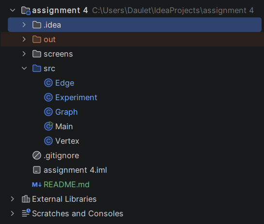
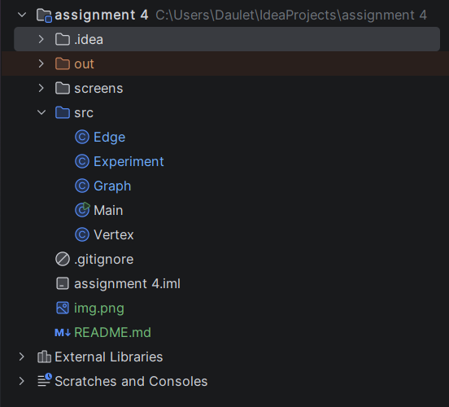
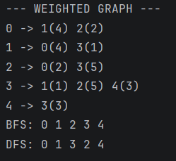

# Graph Traversal and Representation System

## Student Information

- Name: Khanzere Suleimen IT-2504
- Assignment: Assignment 4

---

# Project Overview

This project implements graph traversal algorithms in Java using an adjacency list representation.

The project includes:

- Vertex class
- Edge class
- Graph class
- BFS traversal
- DFS traversal
- Performance experiments

The program creates graphs of different sizes and compares traversal execution time.

---

# Graph Structure

A graph consists of:

- Vertices (nodes)
- Edges (connections between nodes)

The graph is represented using an adjacency list.

## Screenshot: Graph Structure Output

---

# Class Descriptions

## Vertex Class

The Vertex class represents a node in the graph.

Fields:
- id

Methods:
- constructor
- getter
- toString()

---

## Edge Class

The Edge class represents a connection between two vertices.

Fields:
- source
- destination

Methods:
- constructor
- getters
- toString()

---

## Graph Class

The Graph class stores vertices and edges using adjacency lists.

Methods:
- addVertex()
- addEdge()
- printGraph()
- bfs()
- dfs()

---

# BFS Algorithm

Breadth-First Search (BFS) explores the graph level by level.

BFS uses:
- Queue data structure

## BFS Steps

1. Start from a vertex
2. Add it to queue
3. Visit neighbors
4. Repeat until queue becomes empty

## Time Complexity

:contentReference[oaicite:0]{index=0}

Where:
- V = vertices
- E = edges

## Use Cases

- Shortest path
- Network traversal
- Social networks

## Screenshot: BFS Output

---

# DFS Algorithm

Depth-First Search (DFS) explores the graph deeply before backtracking.

DFS uses:
- Recursion
- Stack concept

## DFS Steps

1. Start from a vertex
2. Visit neighbor
3. Continue deeper
4. Backtrack when needed

## Time Complexity

:contentReference[oaicite:1]{index=1}

## Use Cases

- Maze solving
- Cycle detection
- Path finding

## Screenshot: DFS Output

---

# Experimental Results

## Performance Table

| Graph Size | BFS Time (ns) | DFS Time (ns) |
|---|--------------|---|
| 10 | 768000 ns    | 300400 ns |
| 30 | 1482300 ns     | 1302900 ns |
| 100 | 2013500 ns      | 1537300 ns |

## Screenshot: Performance Results

---

# Analysis Questions

## How does graph size affect BFS and DFS performance?

Larger graphs require more processing time because more vertices and edges must be visited.

---

## Which traversal is faster in your experiments?

In my experiments, DFS was slightly faster than BFS.

---

## Do the results match O(V + E)?

Yes. Both algorithms visit each vertex and edge once.

---

## How does graph structure affect traversal order?

Traversal order depends on how vertices are connected inside the graph.

---

## When is BFS preferred over DFS?

BFS is preferred when searching for the shortest path.

---

## What are the limitations of DFS?

DFS may use deeper recursion and does not always find the shortest path.

---

# Reflection

In this assignment, I learned how graph traversal algorithms work using adjacency lists.

I understood the difference between BFS and DFS and how traversal order changes depending on the algorithm.

One challenge was implementing the traversal methods and understanding recursion in DFS.

---

# Project Structure

---

# GitHub Commit History

Example commits:

- init: project structure
- feat(vertex): added Vertex class
- feat(edge): added Edge class
- feat(graph): implemented adjacency list
- feat(traversal): added BFS and DFS
- feat(experiment): added performance tests
- docs(readme): completed README