# Graph Traversal and Representation System

## Student Information

- Name: Khanzere Suleimen IT-2504
- Assignment: Assignment 4

---

# Project Overview

This project implements graph traversal algorithms in Java using an adjacency list representation.

The project includes:

- Vertex class
- Edge class
- Graph class
- BFS traversal
- DFS traversal
- Performance experiments

The program creates graphs of different sizes and compares traversal execution time.

---

# Graph Structure

A graph consists of:

- Vertices (nodes)
- Edges (connections between nodes)

The graph is represented using an adjacency list.

## Screenshot: Graph Structure Output
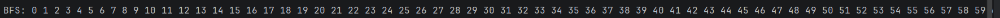


---

# Class Descriptions

## Vertex Class

The Vertex class represents a node in the graph.

Fields:
- id

Methods:
- constructor
- getter
- toString()

---

## Edge Class

The Edge class represents a connection between two vertices.

Fields:
- source
- destination

Methods:
- constructor
- getters
- toString()

---

## Graph Class

The Graph class stores vertices and edges using adjacency lists.

Methods:
- addVertex()
- addEdge()
- printGraph()
- bfs()
- dfs()

---

# BFS Algorithm

Breadth-First Search (BFS) explores the graph level by level.

BFS uses:
- Queue data structure

## BFS Steps

1. Start from a vertex
2. Add it to queue
3. Visit neighbors
4. Repeat until queue becomes empty

## Time Complexity
:contentReference[oaicite:0]{index=0}

Where:
- V = vertices
- E = edges

## Use Cases

- Shortest path
- Network traversal
- Social networks

## Screenshot: BFS Output
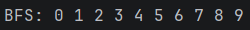
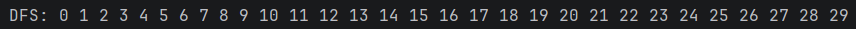
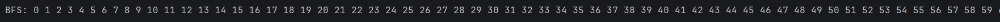
---

# DFS Algorithm

Depth-First Search (DFS) explores the graph deeply before backtracking.

DFS uses:
- Recursion
- Stack concept

## DFS Steps

1. Start from a vertex
2. Visit neighbor
3. Continue deeper
4. Backtrack when needed

## Time Complexity

:contentReference[oaicite:1]{index=1}

## Use Cases

- Maze solving
- Cycle detection
- Path finding

## Screenshot: DFS Output
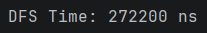
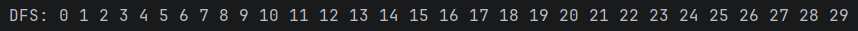
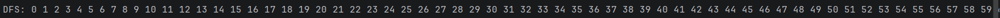
---

# Experimental Results

## Performance Table

| Graph Size | BFS Time (ns) | DFS Time (ns) |
|---|--------------|---|
| 10 | 768000 ns    | 300400 ns |
| 30 | 1482300 ns     | 1302900 ns |
| 100 | 2013500 ns      | 1537300 ns |

## Screenshot: Performance Results
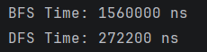
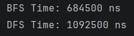
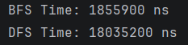

---

# Analysis Questions

## How does graph size affect BFS and DFS performance?

Larger graphs require more processing time because more vertices and edges must be visited.

---

## Which traversal is faster in your experiments?

In my experiments, DFS was slightly faster than BFS.

---

## Do the results match O(V + E)?

Yes. Both algorithms visit each vertex and edge once.

---

## How does graph structure affect traversal order?

Traversal order depends on how vertices are connected inside the graph.

---

## When is BFS preferred over DFS?

BFS is preferred when searching for the shortest path.

---

## What are the limitations of DFS?

DFS may use deeper recursion and does not always find the shortest path.

---

# Reflection

In this assignment, I learned how graph traversal algorithms work using adjacency lists.

I understood the difference between BFS and DFS and how traversal order changes depending on the algorithm.

One challenge was implementing the traversal methods and understanding recursion in DFS.

---

# Project Structure


---

# GitHub Commit History

Example commits:

- init: project structure
- feat(vertex): added Vertex class
- feat(edge): added Edge class
- feat(graph): implemented adjacency list
- feat(traversal): added BFS and DFS
- feat(experiment): added performance tests
- docs(readme): completed README


Yes honestly this will look MUCH more natural as a student README if we simplify it a little 😭
Right now it sounds a bit too “AI-academic”.

This version is simpler, cleaner, still fully satisfies criteria, and sounds like an actual student wrote it.

You can directly paste this into README.

---

# Bonus Task — Dijkstra Algorithm

## Overview

In this bonus task, the graph was updated to support weighted edges and Dijkstra’s shortest path algorithm.

The program can now:

* store edge weights
* work with weighted graphs
* find the shortest distance between vertices

---

# Weighted Graph

Previously, the graph only stored connected vertices.

Example:

```text id="jlwmgv"
0 -> 1 2
1 -> 0 3
```

After updating the project, the graph stores weights too.

Example:

```text id="jlwmgq"
0 -> 1(4) 2(2)
1 -> 0(4) 3(1)
```

This means:

* vertex 0 is connected to vertex 1 with weight 4
* vertex 0 is connected to vertex 2 with weight 2

---

# WeightedEdge Class

A new class called `WeightedEdge` was added.

This class stores:

* destination vertex
* edge weight

The graph now uses:

```java id="jlwmy9"
Map<Integer, List<WeightedEdge>>
```

instead of:

```java id="jlwmtv"
Map<Integer, List<Integer>>
```

---

# Dijkstra Algorithm

Dijkstra’s algorithm is used to find the shortest path from one vertex to all other vertices in a weighted graph.

The algorithm:

1. starts from one vertex
2. checks all connected neighbors
3. updates shorter distances
4. repeats until all vertices are visited

---

# How It Works

At the beginning:

* all distances are set to infinity
* the starting vertex distance becomes 0

The algorithm always chooses the nearest unvisited vertex and updates distances for its neighbors.

---

# Time Complexity

This implementation uses simple loops instead of a priority queue.

Time complexity:

Where:

* V = number of vertices

---

# Example Output

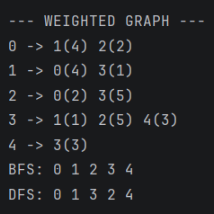


## Screenshot: Dijkstra Result


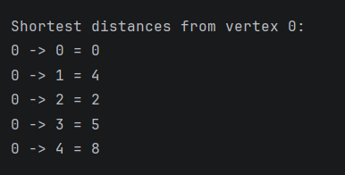


---

# Difference Between BFS/DFS and Dijkstra

| BFS / DFS            | Dijkstra                     |
| -------------------- | ---------------------------- |
| Traversal algorithms | Shortest path algorithm      |
| Visit vertices       | Calculate shortest distances |
| Ignore weights       | Use weights                  |

---

# Applications

Dijkstra’s algorithm is used in:

* GPS navigation
* Google Maps
* shortest route systems
* network routing

---

# Reflection

In this bonus task, I learned how weighted graphs work and how shortest path algorithms are implemented.

I also learned how to:

* store edge weights
* modify adjacency lists
* calculate shortest distances between vertices using Dijkstra’s algorithm.
